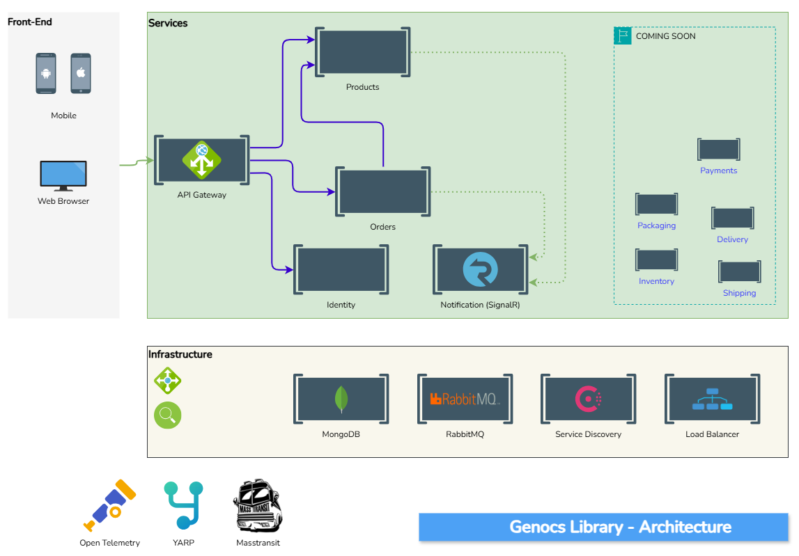

# Genocs Library K8s walkthrough

## Introduction



The repository contains the solution for the Genocs Library K8s challenge. The solution is based on the following requirements:

- Use Genocs Library to build the services
- Host MicroK8s cluster onto Ubuntu Ubuntu 24.04.1 LTS VM  
- Create a Kubernetes cluster with 1 nodes
- Use Ngnix AGIC to expose the web application to the internet
- Deploy Genocs library application
- Use Helm chart to deploy the web application
- Use an internal API gateway to route the traffic to the web application
- Connect to an external MongoDB database
- Connect to an external RabbitMQ message broker 
- Use a Secret to store the database credentials
- Use a ConfigMap to store the web application configuration

Todo:
- Use Let's Encrypt to secure the web application
- Use LXC runtime to create multiple nodes
- Use a Persistent Volume to store the data

# Note to be considered

[linux container virtualization](https://linuxcontainers.org/)


## Install MicroK8s

How to install microk8s on Ubuntu running on Windows WSL2

1. First, install MicroK8s on your Ubuntu WSL2 VM
   ``` bash
   sudo snap install microk8s --classic
   ```

2. Add your user to the microk8s group to avoid using sudo with every command
   ``` bash
   sudo usermod -a -G microk8s $USER
   sudo chown -f -R $USER ~/.kube
   ```

3. Start MicroK8s and wait for it to be ready
   ``` bash
   # Start Microk8s
   microk8s start

   # Check status
   microk8s status --wait-ready
   ```
4. Enable essential addons for your cluster:
   ``` bash
   microk8s enable metallb       # For load balancing
   microk8s enable ingress       # For ingress controller
   microk8s enable dns           # For DNS resolution
   microk8s enable cert-manager  # For SSL/TLS certificate management
   ```

5. Enable community addons and other essential services:
   ``` bash
   microk8s enable community     # For community addons
   ```

6. Check community addons is enabled. By running microk8s status you can see the status of all addons: 
   ``` bash
   microk8s status               # To check the status of all addons
   ```

7. Enable ArgoCD for continuous deployment (ArgoCD is available in the community addons): 
   ``` bash
   microk8s enable argocd        # For continuous deployment
   ```

8. To access the Kubernetes dashboard:
   ``` bash
   # Access the dashboard
   microk8s dashboard-proxy
   ```

9. For WSL2 specific configuration, you'll need to set up port forwarding from Windows to WSL2. You can do this in PowerShell with either of these methods:
   ``` PowerShell
   ## Forward WSL2 IP connections to Windows host 
   
   ### Option 1
   wsl hostname -I
   netsh interface portproxy add v4tov4 listenport=80 listenaddress=0.0.0.0 connectport=80 connectaddress=<WSL2_IP>
   
   ### Option 2
   netsh interface portproxy set v4tov4 listenport=80 listenaddress=0.0.0.0 connectport=80 connectaddress=$(wsl hostname -I)
   ```

10. To verify your installation, you can run these commands:
    ``` bash
    # Check cluster status
    microk8s kubectl get nodes
 
    # Check all resources
    microk8s kubectl get all --all-namespaces
 
    # Create a test deployment
    microk8s kubectl create deployment nginx --image=nginx
    ```

11. To stop MicroK8s when needed:
    ``` bash
    # Stop Microk8s
    microk8s stop
    ```

## **Important Notes**
> - Make sure your WSL2 VM has enough resources allocated (memory and CPU)
> - The default configuration creates a single-node cluster
> - You can use `microk8s kubectl` instead of `kubectl` for all Kubernetes commands
> - For development purposes, you might want to create an alias: `alias kubectl='microk8s kubectl'`


## How to setup and use Helm

Helm is a package manager for Kubernetes that helps you manage Kubernetes applications. It allows you to define, install, and upgrade even the most complex Kubernetes applications. Follow these steps to use Helm with your MicroK8s cluster:


``` bash
# Install Helm
sudo snap install helm --classic
```

Upon installing Helm, you can use it to manage your Kubernetes applications. Here are some common Helm commands:

**Scenario N.1**: Create a new Helm chart from scratch, package it, and deploy it to your cluster

``` bash
# Create a new helm chart
microk8s helm create gnxchart

# Package a chart
cd ./deployment/helm
microk8s helm package gnxchart

# Install the chart on a specific namespace
microk8s helm install dev-gnx-1 ./gnxchart --namespace gnx-apps

# List all the helm charts
microk8s helm list

# List all the helm charts regardless of the namespace
microk8s helm list --all-namespaces

# Upgrade the helm chart by setting the replica count to 3
microk8s helm upgrade dev-gnx-1 ./gnxchart --namespace gnx-apps --set replicaCount=3

# Uninstall the helm chart
microk8s helm uninstall dev-gnx-1
```
----

``` bash
# Initialize infrastructure services
bash ./01-cluster-initialize/setup-infrastructure.sh
```

----
# Useful Commands

Following is a list of useful commands:
``` bash
# Create namespace
microk8s kubectl create namespace gnx-apps

# Create deployment (use it as hello world application)
microk8s kubectl create deployment nginx --image=nginx
microk8s kubectl create deployment microbot --image=dontrebootme/microbot:v1

# Create a deployment on a namespace
microk8s kubectl create deployment --namespace=gnx-apps microbot --image=dontrebootme/microbot:v1

# delete deployment
microk8s kubectl delete deployment microbot

# Create service
microk8s kubectl expose deployment nginx --port 5101 --target-port 80 --selector app=nginx --type LoadBalancer --name nginx2
microk8s kubectl expose deployment --namespace=gnx-apps nginx --port 5101 --target-port 80 --selector app=nginx --type LoadBalancer --name nginx2
microk8s kubectl expose deployment --namespace=gnx-apps apigateway --port 5180 --target-port 80 --type LoadBalancer --name apigateway2
microk8s kubectl expose deployment --namespace=gnx-apps apigateway --port 80 --type ClusterIP --name apigateway2

# Scale deployments
microk8s kubectl scale deployment nginx --replicas=1

watch microk8s kubectl get all

microk8s kubectl port-forward -n default service/microbot 80:80 --address 0.0.0.0
```

To run the application, you can use the following commands:
``` bash
# Use yaml files
microk8s kubectl apply -f ./deployment/namespace.yml
microk8s kubectl apply -f ./deployment/secrets.yml
microk8s kubectl apply -f ./deployment/nginx-ingress.yml
microk8s kubectl apply -f ./deployment/cert-manager.yml
microk8s kubectl apply -f ./deployment/apigateway.yml
microk8s kubectl apply -f ./deployment/identities.yml
microk8s kubectl apply -f ./deployment/products.yml
microk8s kubectl apply -f ./deployment/orders.yml
microk8s kubectl apply -f ./deployment/notifications.yml
```

or alternatively, you can use the following command to deploy the application:


### How to Enable IP Forwarding

``` bash
# Install iptables if not already installed
sudo apt install iptables

# Check if iptables is installed
iptables --version

# Check current iptables rules
iptables -L

# Check NAT table rules
iptables -t nat -L

sysctl net.ipv4.ip_forward=1

# Add your forwarding rule (use n.n.n.n:port):
iptables -t nat -A PREROUTING -p tcp -d 172.24.129.237 --dport 5101 -j DNAT --to-destination 10.1.203.0:80

# Ask IPtables to Masquerade:
iptables -t nat -A POSTROUTING ! -s 127.0.0.1 -j MASQUERADE


netsh interface portproxy show all
```

# Setup MicroK8s Dashboard to Start Automatically

To set up MicroK8s to automatically start the dashboard when the cluster starts, we need to create a systemd service. Here's how to do it:

1. Create a systemd service file for the dashboard. Create a new file at `/etc/systemd/system/microk8s-dashboard.service` with the following content:

   ```ini
   [Unit]
   Description=MicroK8s Dashboard Service
   After=snap.microk8s.daemon-kubelite.service
   Requires=snap.microk8s.daemon-kubelite.service
   
   [Service]
   Type=simple
   User=root
   ExecStart=/snap/bin/microk8s dashboard-proxy
   Restart=always
   RestartSec=10
   
   [Install]
   WantedBy=multi-user.target
   ```

2. Enable and start the service:
   ```bash
   sudo systemctl daemon-reload
   sudo systemctl enable microk8s-dashboard.service
   sudo systemctl start microk8s-dashboard.service
   ```

3. Verify the service is running:
   ```bash
   sudo systemctl status microk8s-dashboard.service
   ```

4. To make the dashboard accessible from outside the cluster, you'll need to set up port forwarding. Add this to your WSL2 startup script or run it manually:

   ```bash
   # Get the WSL2 IP address
   WSL_IP=$(wsl hostname -I)
   
   # Set up port forwarding in Windows PowerShell
   netsh interface portproxy add v4tov4 listenport=10443 listenaddress=0.0.0.   0 connectport=10443 connectaddress=$WSL_IP
   ```

5. To make the port forwarding persistent across WSL2 restarts, you can create a startup script in your WSL2 environment. Create a file at `~/.wslconfig` with:

   ```bash
   #!/bin/bash
   # Wait for network to be ready
   sleep 10
   
   # Get WSL2 IP
   WSL_IP=$(hostname -I | awk '{print $1}')
   
   # Set up port forwarding
   powershell.exe -Command "netsh interface portproxy add v4tov4    listenport=10443 listenaddress=0.0.0.0 connectport=10443    connectaddress=$WSL_IP"
   ```

6. Make the script executable and add it to your `.bashrc`:
   ```bash
   chmod +x ~/.wslconfig
   echo "~/.wslconfig" >> ~/.bashrc
   ```

Now the dashboard will:
- Start automatically when MicroK8s starts
- Restart automatically if it crashes
- Be accessible at [https://localhost:10443](https://localhost:10443) from your Windows host
- Persist across WSL2 restarts

To access the dashboard:
1. Open your browser and navigate to [https://localhost:10443](https://localhost:10443)
2. You'll need to get the token for authentication:
   ```bash
   microk8s kubectl create token default -n kube-system
   ```


# How to setup pull images from private registry
To set up your MicroK8s cluster to pull images from a private registry, you need to create a Kubernetes secret that contains your registry credentials. Here's how to do it:
```bash
# Create a secret for your private registry
microk8s kubectl create secret docker-registry my-registry-secret \
  --docker-server=<your-registry-server> \
  --docker-username=<your-username> \
  --docker-password=<your-password> \
  --docker-email=<your-email> \
  --namespace gnx-apps
```
Replace `<your-registry-server>`, `<your-username>`, `<your-password>`, and `<your-email>` with your actual registry details.
# Use the secret in your deployment
When you create or update your deployment, specify the imagePullSecrets field to use the secret you just created. Here's an example of how to do this in a deployment YAML file:
```yaml
apiVersion: apps/v1
kind: Deployment
metadata:
  name: my-app
  namespace: gnx-apps
spec:
   replicas: 1
   selector:
      matchLabels:
         app: my-app
   template:
      metadata:
         labels:
         app: my-app
      spec:
         imagePullSecrets:
         - name: my-registry-secret
         containers:
         - name: my-container
         image: <your-registry-server>/<your-image>:<tag>
         ports:
         - containerPort: 80
   ```

After applying this deployment, your MicroK8s cluster will use the specified secret to authenticate with your private registry when pulling images.


Official documentation for MicroK8s can be found at [MicroK8s Documentation](https://kubernetes.io/docs/tasks/configure-pod-container/pull-image-private-registry/)

# How to setup Let's Encrypt with Nginx Ingress Controller
To set up Let's Encrypt with the Nginx Ingress Controller in your MicroK8s cluster, follow these steps:
1. **Install the Nginx Ingress Controller**:
   If you haven't already installed the Nginx Ingress Controller, you can do so with the following command:
   ```bash
   microk8s enable ingress
   ```
2. **Install Cert-Manager**:
   Cert-Manager is a Kubernetes add-on that automates the management and issuance of TLS certificates from various issuing sources, including Let's Encrypt. You can enable it with:
   ```bash
   microk8s enable cert-manager
   ```
3. **Create a ClusterIssuer**:
   A ClusterIssuer is a resource that defines how certificates should be issued. Create a YAML file named `cluster-issuer.yml` with the following content:
   ```yaml
   apiVersion: cert-manager.io/v1
   kind: ClusterIssuer
   metadata:
     name: letsencrypt-prod
   spec:
     acme:
       server: https://acme-v02.api.letsencrypt.org/directory
       email:  <


