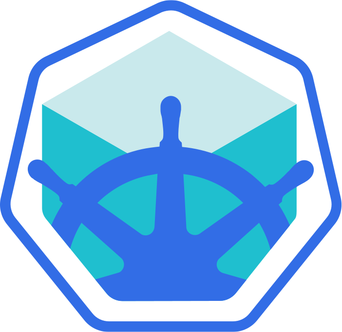

# Miscellaneous

## kind


- [kind](https://kind.sigs.k8s.io/) is a tool for running local Kubernetes clusters using Docker container "nodes". It is primarily designed for testing Kubernetes itself, but it can also be used to run local clusters for development and testing purposes.

- [Kubeadm](https://kubernetes.io/docs/setup/production-environment/tools/kubeadm/) is a tool provided by Kubernetes to help you bootstrap a Kubernetes cluster. It simplifies the process of setting up a cluster by automating tasks such as generating certificates, creating configuration files, and starting the control plane components.

## minikube



- [minikube](https://minikube.sigs.k8s.io/docs/) is a tool that makes it easy to run Kubernetes locally. It creates a virtual machine on your local machine and runs a single-node Kubernetes cluster inside it. Minikube is ideal for development and testing purposes, allowing you to experiment with Kubernetes without needing a full cluster setup.

## MicroK8s

- [MicroK8s](https://microk8s.io/) is a lightweight, single-package Kubernetes distribution designed for developers and DevOps teams. It provides a simple way to run Kubernetes on your local machine or in the cloud, with minimal setup and resource requirements.

## K3s

- [K3s](https://k3s.io/) is a lightweight, certified Kubernetes distribution designed for resource-constrained environments and edge computing. It is easy to install and maintain, making it ideal for IoT devices, ARM processors, and low-resource systems.

- [Dapr](https://www.dapr.io/) is a portable, event-driven runtime that makes it easy for developers to build resilient, stateless, and stateful applications that run on the cloud and edge. It provides APIs for common application patterns such as service invocation, state management, pub/sub messaging, and more.

- [KEDA](https://keda.sh/) (Kubernetes-based Event Driven Autoscaling) is a Kubernetes-based component that allows you to scale applications based on the number of events needing to be processed. It works with any containerized workload and can be used with various event sources like Kafka, RabbitMQ, Azure Queue Storage, and more.

## Setup kind cluster

To set up a kind cluster, you can use the following command with a configuration file:

```bash
kind create cluster --config 05-kind-multinode/kind-cluster-config.yaml
```

This command will create a Kubernetes cluster using the configuration specified in the `kind-cluster-config.yaml` file. The configuration file allows you to customize the cluster settings, such as the number of nodes, their roles, and other parameters.

```bash
dapr init --kubernetes
```
