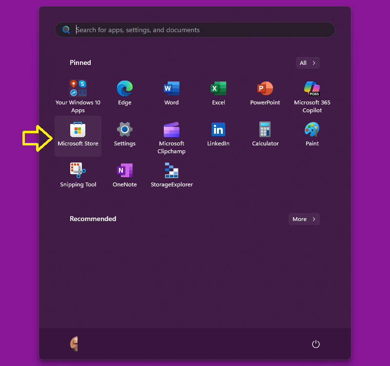
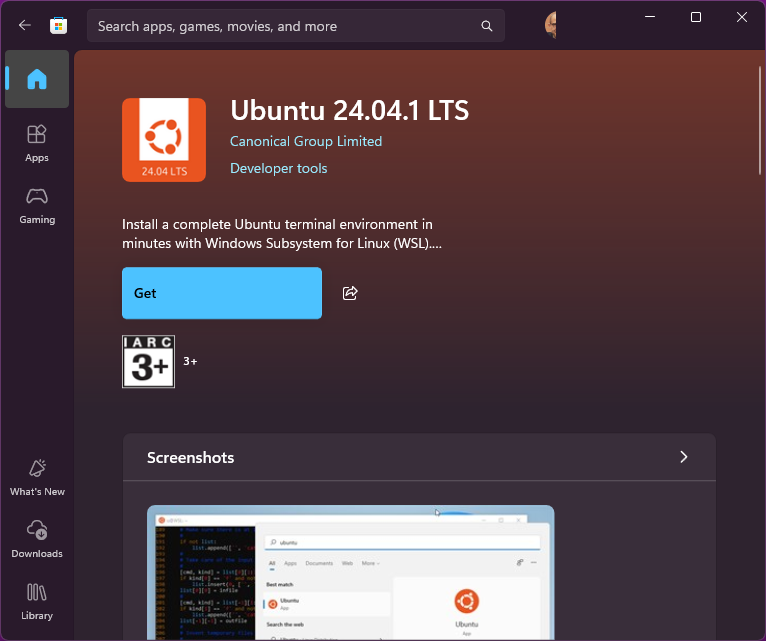

# Install WSL2
This file provides a step-by-step guide to install WSL2 on Windows, 

## Prerequisites
- Windows 10 or later
- Virtualization enabled in BIOS

## Installation Steps
   - Follow the instructions from the [Microsoft documentation](https://docs.microsoft.com/en-us/windows/wsl/install) to install WSL2.

Other option could be to use Microsoft Store to install Ubuntu:

1. **Install Ubuntu from Microsoft Store**:
   - Open Microsoft Store and search for "Ubuntu"

   

   - Select the desired version of Ubuntu (e.g., Ubuntu 24.04 LTS)

   

   - Click on "Get" to install it.

2. **Install WSL2 by command line**:
   - Open PowerShell as Administrator and run the following command to set WSL2 as the default version:
     ```powershell
     wsl --set-default-version 2
     ```

   - Open PowerShell as Administrator and run:
     ```powershell
     wsl --install -d Ubuntu
     ```

   - If you want to install a specific version of Ubuntu, you can specify it like this:     
     ```powershell
     wsl --install -d Ubuntu-24.04
     ```

   - If you want to check the WSL version
     ```bash
     wsl --list --all --verbose
     ```
     You should see something like this:
     ```plaintext
       NAME                   STATE           VERSION
     * Ubuntu-24.04           Running         2
     ```

   - If you want to check the WSL version of the default distro
     ```bash
     wsl --status
     ```
     You should see something like this:
     ```plaintext
     Default Distribution: Ubuntu-22.04
     Default Version: 2
     ```
     
     If you want to setup the default distro to Ubuntu-24.04
     ```bash
     wsl --set-default Ubuntu-24.04
     ```


### Set Up Ubuntu and enable systemd
After the installation is complete, you will need to set up Ubuntu. Open the Ubuntu app from the Start menu or type `wsl` in PowerShell to launch it.
```bash
# Get the Ubuntu version
lsb_release -a
```
You should see something like this:
```plaintext
No LSB modules are available.
Distributor ID: Ubuntu
Description:    Ubuntu 24.04.2 LTS
Release:        24.04
Codename:       noble
```

After installing, set up Ubuntu by creating a username and password in the first-time setup.

Now, follow these steps:

Enable systemd in WSL2.
```bash
sudo nano /etc/wsl.conf
```
This will open the `wsl.conf` file in the nano text editor. If the file does not exist, it will create a new one.
If you see a blank file, you can proceed to add the necessary configuration. If there are existing lines, make sure to add the new lines without removing any existing configurations.
Add the following lines in it and save.

```ini
[boot]
systemd=true
#[network]
#generateResolvConf=false
```

Shutdown wsl2 and start it again.

```bash
wsl --shutdown
wsl
```

## Install Snapd

- **Snapd**: Make sure `snapd` is installed on your Ubuntu WSL2 VM. You can install it with:
  ```bash
  sudo apt update
  sudo apt install snapd
  ```

## Enable IP Forwarding
``` bash
# Install net-tools
sudo apt install net-tools

# Install iptables if not already installed
sudo apt install iptables

# Check if iptables is installed
iptables --version

# Check current iptables rules
iptables -L

# Check NAT table rules
iptables -t nat -L

sysctl net.ipv4.ip_forward=1

# Add your forwarding rule (use n.n.n.n:port):
iptables -t nat -A PREROUTING -p tcp -d <your-src-port> --dport 5101 -j DNAT --to-destination <your-destination-ip>:80

# Ask IPtables to Masquerade:
iptables -t nat -A POSTROUTING ! -s 127.0.0.1 -j MASQUERADE


netsh interface portproxy show all
```